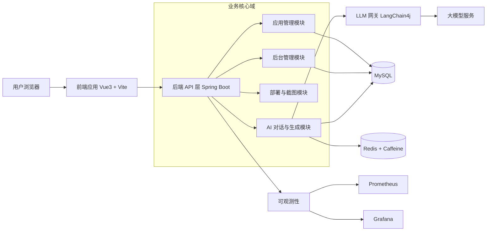

# No Code AI

一个基于 Spring Boot 3 + LangChain4j + Vue 3 的 AI 零代码应用生成平台。

用户通过自然语言描述需求，系统自动完成代码生成、流式展示、可视化编辑、部署与分享，适合用于 AI 应用工程化实践与企业级系统设计探索。

## 项目亮点

- AI 智能代码生成：根据需求自动路由生成策略，支持多文件输出
- 实时流式交互：完整展示 AI 推理与执行过程，提升可观测性
- 可视化二次编辑：生成后可继续用自然语言修改页面与功能
- 一键部署分享：支持在线访问、封面图生成与源码下载
- 管理后台能力：包含用户管理、应用管理、系统与业务监控

## 系统架构图



## 功能模块

### 1. AI 代码生成模块

- 接收自然语言需求并进行任务解析
- 基于生成策略路由不同的代码生成流程
- 支持流式返回生成过程与结果

### 2. 对话与上下文管理模块

- 维护多轮对话上下文与历史消息
- 支持生成任务的中间状态追踪
- 提供可扩展的 Prompt 管理能力

### 3. 应用管理模块

- 管理应用的创建、更新、发布与删除
- 维护应用元数据、版本与状态
- 支持应用详情展示与检索

### 4. 可视化编辑模块

- 对生成页面进行可视化预览
- 通过自然语言继续微调页面和交互
- 形成生成 - 反馈 - 迭代的闭环

### 5. 部署与截图模块

- 一键触发部署流程并生成访问链接
- 自动生成应用封面图用于展示与分享
- 支持源码下载与成果沉淀

### 6. 管理后台与监控模块

- 提供用户管理、应用管理等后台能力
- 采集系统运行指标、接口性能、AI 调用指标
- 通过看板支持运维排障和容量评估

## 核心能力

### 1. 智能生成

输入业务需求后，系统自动分析任务类型并调用合适的生成链路，产出可运行应用代码。

### 2. 交互式编辑

支持预览 + 对话式修改闭环，用户可以围绕已有页面继续迭代。

### 3. 应用部署与分发

支持应用部署、地址分享、页面截图与成果沉淀，降低交付门槛。

### 4. 平台化运营

提供后台管理与监控能力，便于观察 AI 调用、系统性能和业务指标。

## 技术选型

### 选型原则

- 工程可维护：优先选择生态成熟、社区活跃的技术
- AI 能力扩展：支持多模型接入、工作流扩展和工具调用
- 性能与成本平衡：通过缓存、流式输出和监控体系优化资源使用

### 后端选型

- Java 21：LTS 版本，性能与语言特性更适合长期演进
- Spring Boot 3：统一 Web、配置、监控与依赖管理，工程化能力强
- LangChain4j / LangGraph4j：构建 AI Agent、工作流与工具调用能力
- MyBatis + MySQL：数据访问可控，便于复杂 SQL 与业务建模
- Redis + Caffeine：构建多级缓存，降低重复 AI 调用与数据库压力

### 前端选型

- Vue 3：响应式能力强，组件化开发体验好
- TypeScript：提升复杂业务场景下的可维护性与类型安全
- Vite：本地启动与构建速度快，适合持续迭代

### 可观测性选型

- Prometheus：标准化采集系统与业务指标
- Grafana：可视化监控面板与告警基础能力

### 架构形态

- 单体工程（当前目录）
- 微服务拆分工程（yu-ai-code-mother-microservice）

## 目录结构

```text
.
src/                          # 主后端源码
sql/                          # 数据库脚本
grafana/                      # Grafana 配置
prometheus.yml                # Prometheus 配置
yu-ai-code-mother-frontend/   # 前端项目
yu-ai-code-mother-microservice/ # 微服务版本
```

## 环境要求

- JDK 21+
- Maven 3.9+
- Node.js 18+
- MySQL 8+
- Redis 6+

## 快速开始

### 1. 克隆项目

```bash
git clone https://github.com/csmgfq/No_code_AI.git
cd No_code_AI
```

### 2. 初始化数据库

执行脚本：

```text
sql/create_table.sql
```

### 3. 启动后端

1) 修改配置文件：

- src/main/resources/application.yml
- src/main/resources/application-local.yml

2) 启动服务：

```bash
./mvnw spring-boot:run
```

Windows 可使用：

```bash
mvnw.cmd spring-boot:run
```

### 4. 启动前端

```bash
cd yu-ai-code-mother-frontend
npm install
npm run dev
```

默认开发地址（以本地输出为准）：

- 前端：http://localhost:5173
- 后端：http://localhost:8101

## 监控与运维

- Prometheus 配置文件：prometheus.yml
- Grafana 仪表盘配置：grafana/ai_model_grafana_config.json

可根据实际环境接入容器、日志平台和告警系统。

## 微服务版本说明

yu-ai-code-mother-microservice 目录下提供微服务拆分版本，包含 AI、应用、用户、网关等模块，可用于进一步演进高并发和大规模部署场景。

## 常见问题

### 1. 启动报数据库连接错误

检查 application-local.yml 中数据库地址、账号、密码与库名是否正确。

### 2. 前端请求跨域或接口 404

确认后端已启动，且前端请求地址与后端端口一致。

### 3. AI 调用失败

检查大模型 API Key、模型名称和网络连通性配置。

## 免责声明

本项目用于学习、研究与工程实践。请在遵守相关法律法规、平台协议与数据安全规范的前提下使用。

## License

如未单独声明，请根据仓库中的许可证文件使用本项目。
